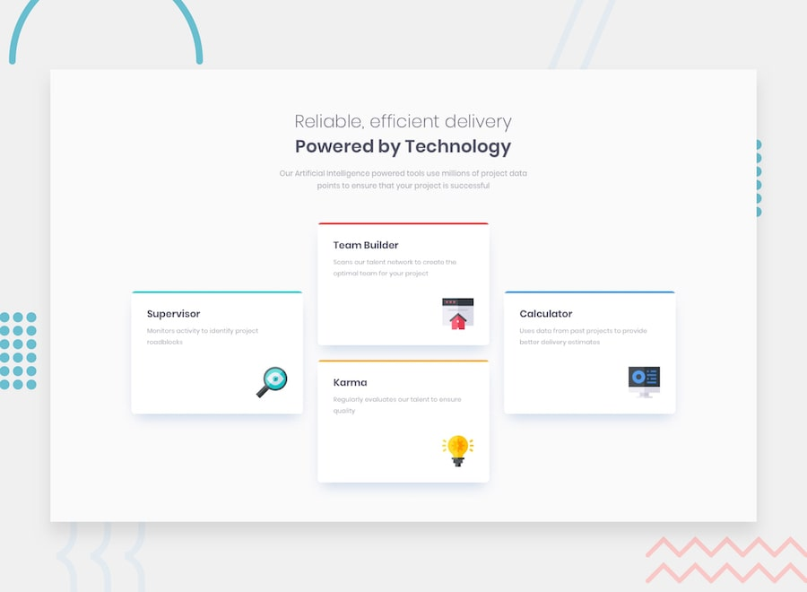

    
    <h1>Bryan's Projects - Frontend Mentor [Vanilla Ver.]</h1>
    
     
     
    

        
        
        
    

&nbsp;

> [!IMPORTANT]
> This repository contains my work on Frontend Mentor projects (vanilla/no frameworks).
> Projects written using frameworks can be found in separate repositories.

## Table of Contents
- [About](#about)
- [Projects](#projects)
- [Project Details](#details)
- [Usage](#usage)
- [Feedback](#feedback)
- [License](#license)
- [Contact](#contact)
- [Acknowledgements](#acknowledgements)

View Custom Directory (Completed Challenges Only): <a href="https://frontend-mentor-challenges-pi-sage.vercel.app/"><ins>HERE</ins></a>

## 🚀 About

## Usage
> [!WARNING]
> This repository is for portfolio reference only. Copying or redistribution is not permitted.

## Projects
| Project Name | Difficulty | Attempt Details | Official Source |
| :- | :-: | :-: | :-: |
| 3 Column Preview Card Component |  | |  |
| Advice Generator App |  | | |
| Age Calculator App |  | | |
| Article Preview Component |  | | |
| Blog Preview Card |  | | |
| Clipboard Landing Page |  | | |
| Expenses Chart Component |  | | |
| FAQ Accordion Card |  | | |
| Four Card Feature Section |  | | |
| Fylo Dark Theme Landing Page |  | | |
| Fylo Data Storage Component |  | | |
| Huddle Landing Page with Alternating Feature Blocks |  | | |
| Interactive Rating Component |  | | |
| IP Address Tracker |  | | |
| News Homepage |  | | |
| Newsletter Sign Up with Success Message |  | | |
| NFT Preview Card Component |  | | |
| Order Summary Component |  | | |
| Ping Coming Soon Page |  | | |
| Pod Request Access Landing Page |  | | |
| Product Preview Card Component |  | | |
| Profile Card Component |  | | |
| QR Code Component |  | | |
| Recipe Page |  | | |
| Results Summary Component |  | | |
| Rock Paper Scissors |  | | |
| Room Homepage |  | | |
| Single Price Grid Component |  | | |
| Social Links Profile |  | | |
| Social Proof Section |  | | |
| Space Tourism Website |  | | |
| Stats Preview Card Component |  | | |
| Testimonials Grid Section |  | | |
| Time Tracking Dashboard |  | | |
| Tip Calculator App |  | | |

## Feedback

## License

## Contact

## Acknowledgements

## Details

### 3 Column Preview Card Component

| Trial | Tech Stack | Date | 🔗 Links | 📝 Summary |
| :-: | :-: | :-: | :- | :- |
| #1 |   | Jun 12th, 2023 | [💾 Challenge](https://www.frontendmentor.io/challenges/3column-preview-card-component-pH92eAR2-)   [📨 Entry](https://www.frontendmentor.io/solutions/3-colum-preview-card-component-bx04fR0CV3)   [👨‍💻 My Code](https://github.com/Zy8712/frontend-mentor-challenges/tree/main/3-column-preview-card-component/my-work)   [🖥️ Preview](https://frontend-mentor-challenges-pi-sage.vercel.app/3-column-preview-card-component/my-work/index.html) | - background-color:rgba(0,0,0,0) |
| #2 |     | Aug 8th, 2023 | [💾 Challenge](https://www.frontendmentor.io/challenges/3column-preview-card-component-pH92eAR2-)    [📨 Entry](#)   [👨‍💻 My Code](https://github.com/Zy8712/frontend-mentor-challenges/tree/main/3-column-preview-card-component/my-work-v2-tailwindcss)   [🖥️ Preview](https://frontend-mentor-challenges-pi-sage.vercel.app/3-column-preview-card-component/my-work-v2-tailwindcss/index.html) | - tailwind css |
| #3 |     | Aug 29th, 2023 | [💾 Challenge](https://www.frontendmentor.io/challenges/3column-preview-card-component-pH92eAR2-)    [📨 Entry](#)   [👨‍💻 My Code](https://github.com/Zy8712/frontend-mentor-challenges-react/tree/main/3-column-preview-card-component/my-react-work-v1)   [🖥️ Preview](#) | - ReactJS   - TailwindCSS |

### Advice Generator App

| Trial | Tech Stack | Date | 🔗 Links | 📝 Summary |
| :-: | :-: | :-: | :- | :- |
| #1 |    | Jul 27th, 2023 | [💾 Challenge](https://www.frontendmentor.io/challenges/advice-generator-app-QdUG-13db)   [📨 Entry](https://www.frontendmentor.io/solutions/advice-generator-app-POlPklQasY)   [👨‍💻 My Code](https://github.com/Zy8712/frontend-mentor-challenges/tree/main/advice-generator-app/my-work)   [🖥️ Preview](https://frontend-mentor-challenges-pi-sage.vercel.app/advice-generator-app/my-work/index.html) | - api-access   - button:disabled   - cursor:none-allowed   - setTimeout   - rotate   - transform|
| #2 |      | Aug 14th, 2023 | [💾 Challenge](https://www.frontendmentor.io/challenges/advice-generator-app-QdUG-13db)   [📨 Entry](#)   [👨‍💻 My Code](https://github.com/Zy8712/frontend-mentor-challenges/tree/main/advice-generator-app/my-work)   [🖥️ Preview](#) | - ReactJS |
| #3 |     | Oct 6th, 2023 | [💾 Challenge](https://www.frontendmentor.io/challenges/advice-generator-app-QdUG-13db)   [📨 Entry](#)   [👨‍💻 My Code](https://github.com/Zy8712/frontend-mentor-challenges-react/tree/main/advice-generator-app/my-react-work-v2)   [🖥️ Preview](#) | - ReactJS |
   

### Age Calculator App

| Trial | Tech Stack | Date | 🔗 Links | 📝 Summary |
| :-: | :-: | :-: | :- | :- |
| #1 |    | Jul 23rd, 2023 | [💾 Challenge](https://www.frontendmentor.io/challenges/age-calculator-app-dF9DFFpj-Q)   [📨 Entry](https://www.frontendmentor.io/solutions/age-calculator-app-8b0ZHnNRAr)   [👨‍💻 My Code](https://github.com/Zy8712/frontend-mentor-challenges/tree/main/age-calculator-app/my-work)   [🖥️ Preview](https://frontend-mentor-challenges-pi-sage.vercel.app/age-calculator-app/my-work/index.html) | - localStorage   - :focus   - outline:none |

### Article Preview Component

| Trial | Tech Stack | Date | 🔗 Links | 📝 Summary |
| :-: | :-: | :-: | :- | :- |
| #1 |    | Jul 1st, 2023 | [💾 Challenge](https://www.frontendmentor.io/challenges/article-preview-component-dYBN_pYFT)   [📨 Entry](https://www.frontendmentor.io/solutions/article-preview-component-8AC3WxuhNz)   [👨‍💻 My Code](https://github.com/Zy8712/frontend-mentor-challenges/tree/main/article-preview-component/my-work)   [🖥️ Preview](https://frontend-mentor-challenges-pi-sage.vercel.app/article-preview-component/my-work/index.html) | - triangle-shape-made-using-border |

### Blog Preview Card

### Clipboard Landing Page

| Trial | Tech Stack | Date | 🔗 Links | 📝 Summary |
| :-: | :-: | :-: | :- | :- |
| #1 |    | Sept 14th, 2023 | [💾 Challenge](https://www.frontendmentor.io/challenges/clipboard-landing-page-5cc9bccd6c4c91111378ecb9)   [📨 Entry](https://www.frontendmentor.io/solutions/clipboard-landing-page-6wdy5EYFmN)   [👨‍💻 My Code](https://github.com/Zy8712/frontend-mentor-challenges/tree/main/clipboard-landing-page/my-work)   [🖥️ Preview](https://frontend-mentor-challenges-pi-sage.vercel.app/clipboard-landing-page/my-work/index.html) | |

### Expenses Chart Component

| Trial | Tech Stack | Date | 🔗 Links | 📝 Summary |
| :-: | :-: | :-: | :- | :- |
| #1 |      | Aug 11th, 2023 | [💾 Challenge](https://www.frontendmentor.io/challenges/expenses-chart-component-e7yJBUdjwt)   [📨 Entry](https://www.frontendmentor.io/solutions/expenses-chart-component-7HFSNcqBMS)   [👨‍💻 My Code](https://github.com/Zy8712/frontend-mentor-challenges/tree/main/expenses-chart-component/my-work)   [🖥️ Preview](https://frontend-mentor-challenges-pi-sage.vercel.app/expenses-chart-component/my-work/index.html) | - ChartJS |

### FAQ Accordion Card

| Trial | Tech Stack | Date | 🔗 Links | 📝 Summary |
| :-: | :-: | :-: | :- | :- |
| #1 |   | Jun 30th, 2023 | [💾 Challenge](https://www.frontendmentor.io/challenges/faq-accordion-card-XlyjD0Oam)   [📨 Entry](https://www.frontendmentor.io/solutions/faq-accordion-card-pure-html-and-css-no-js-x32Gj2HTI0)   [👨‍💻 My Code](https://github.com/Zy8712/frontend-mentor-challenges/tree/main/faq-accordion-card/my-work)   [🖥️ Preview](https://frontend-mentor-challenges-pi-sage.vercel.app/faq-accordion-card/my-work/index.html) | - transform:rotate(-180deg)   - min-height   - summary::-webkit-details-marker   - [open]   - customizing details & summary |

### Four Card Feature Section

| Trial | Tech Stack | Date | 🔗 Links | 📝 Summary |
| :-: | :-: | :-: | :- | :- |
| #1 |   | Jul 16th, 2023 | [💾 Challenge](https://www.frontendmentor.io/challenges/four-card-feature-section-weK1eFYK)   [📨 Entry](https://www.frontendmentor.io/solutions/four-card-feature-section--oQiA0MbvB)   [👨‍💻 My Code](https://github.com/Zy8712/frontend-mentor-challenges/tree/main/four-card-feature-section/my-work)   [🖥️ Preview](https://frontend-mentor-challenges-pi-sage.vercel.app/four-card-feature-section/my-work/index.html) |  |

### Fylo Dark Theme Landing Page

| Trial | Tech Stack | Date | 🔗 Links | 📝 Summary |
| :-: | :-: | :-: | :- | :- |
| #1 |     | Aug 5th, 2023 | [💾 Challenge](https://www.frontendmentor.io/challenges/fylo-dark-theme-landing-page-5ca5f2d21e82137ec91a50fd)   [📨 Entry](https://www.frontendmentor.io/solutions/fylo-dark-theme-landing-page-NxcaRtrhLs)   [👨‍💻 My Code](https://github.com/Zy8712/frontend-mentor-challenges/tree/main/fylo-dark-theme-landing-page/my-work)   [🖥️ Preview](https://frontend-mentor-challenges-pi-sage.vercel.app/fylo-dark-theme-landing-page/my-work/index.html) | - scss |

### Fylo Data Storage Component

| Trial | Tech Stack | Date | 🔗 Links | 📝 Summary |
| :-: | :-: | :-: | :- | :- |
| #1 |   | Jul 7th, 2023 | [💾 Challenge](https://www.frontendmentor.io/challenges/fylo-data-storage-component-1dZPRbV5n)   [📨 Entry](https://www.frontendmentor.io/solutions/fylo-data-storage-component-9keEWaAQjz)   [👨‍💻 My Code](https://github.com/Zy8712/frontend-mentor-challenges/tree/main/fylo-data-storage-component/my-work)   [🖥️ Preview](https://frontend-mentor-challenges-pi-sage.vercel.app/fylo-data-storage-component/my-work/index.html) | - background-position: bottom 0px right 0px   - progress bar   - postion:relative   - position:absolute |

### Huddle Landing Page with Alternating Feature Blocks

| Trial | Tech Stack | Date | 🔗 Links | 📝 Summary |
| :-: | :-: | :-: | :- | :- |
| #1 |    | Aug 26th, 2023 | [💾 Challenge](https://www.frontendmentor.io/challenges/huddle-landing-page-with-alternating-feature-blocks-5ca5f5981e82137ec91a5100)   [📨 Entry](https://www.frontendmentor.io/solutions/huddle-landing-page-8QRB5W0hmu)   [👨‍💻 My Code](https://github.com/Zy8712/frontend-mentor-challenges/tree/main/huddle-landing-page-with-alternating-feature-blocks/my-work)   [🖥️ Preview](https://frontend-mentor-challenges-pi-sage.vercel.app/huddle-landing-page-with-alternating-feature-blocks/my-work/index.html) |  |

### Interactive Rating Component

| Trial | Tech Stack | Date | 🔗 Links | 📝 Summary |
| :-: | :-: | :-: | :- | :- |
| #1 |    | Jun 8th, 2023 | [💾 Challenge](https://www.frontendmentor.io/challenges/interactive-rating-component-koxpeBUmI)   [📨 Entry](https://www.frontendmentor.io/solutions/interactive-rating-component-rtYk-cl4oF)   [👨‍💻 My Code](https://github.com/Zy8712/frontend-mentor-challenges/tree/main/interactive-rating-component)   [🖥️ Preview](https://frontend-mentor-challenges-pi-sage.vercel.app/interactive-rating-component/my-work/index.html) | - justify-content:space-between   - display:none   - horizontal centering   - vertical centering   - display:flex   - flex-direction:column   - align-items: center   - min-height:100vh |
| #2 |     | Aug 1st, 2023 | [💾 Challenge](https://www.frontendmentor.io/challenges/interactive-rating-component-koxpeBUmI)   [📨 Entry](https://www.frontendmentor.io/solutions/interactive-rating-component-using-sassscss-FpQcumQJXM)   [👨‍💻 My Code](https://github.com/Zy8712/frontend-mentor-challenges/tree/main/interactive-rating-component/my-work-v2-sass)   [🖥️ Preview](https://frontend-mentor-challenges-pi-sage.vercel.app/interactive-rating-component/my-work-v2-sass/index.html) | - scss |

### IP Address Tracker

| Trial | Tech Stack | Date | 🔗 Links | 📝 Summary |
| :-: | :-: | :-: | :- | :- |
| #1 |     | Aug 7th, 2023 | [💾 Challenge](https://www.frontendmentor.io/challenges/ip-address-tracker-I8-0yYAH0)   [📨 Entry](https://www.frontendmentor.io/solutions/ip-address-tracker-RkmcuoFlxl)   [👨‍💻 My Code](https://github.com/Zy8712/frontend-mentor-challenges/tree/main/ip-address-tracker/my-work)   [🖥️ Preview](https://frontend-mentor-challenges-pi-sage.vercel.app/ip-address-tracker/my-work/index.html) | - Leaflet-Library   - Geo Ipify   - nth-of-type() |

### News Homepage

| Trial | Tech Stack | Date | 🔗 Links | 📝 Summary |
| :-: | :-: | :-: | :- | :- |
| #1 |    | Jul 14th, 2023 | [💾 Challenge](https://www.frontendmentor.io/challenges/news-homepage-H6SWTa1MFl)   [📨 Entry](https://www.frontendmentor.io/solutions/news-homepage-Z5PzicRyH6)   [👨‍💻 My Code](https://github.com/Zy8712/frontend-mentor-challenges/tree/main/news-homepage/my-work)   [🖥️ Preview](https://frontend-mentor-challenges-pi-sage.vercel.app/news-homepage/my-work/index.html) | - navbar-overlay   - CSS NESTING |

### Newsletter Sign-up with Success Message

| Trial | Tech Stack | Date | 🔗 Links | 📝 Summary |
| :-: | :-: | :-: | :- | :- |
| #1 |    | Jul 1st, 2023 | [💾 Challenge](https://www.frontendmentor.io/challenges/newsletter-signup-form-with-success-message-3FC1AZbNrv)   [📨 Entry](https://www.frontendmentor.io/solutions/newsletter-signup-form-with-success-message-_1HqFFvXBf)   [👨‍💻 My Code](https://github.com/Zy8712/frontend-mentor-challenges/tree/main/newsletter-sign-up-with-success-message/my-work)   [🖥️ Preview](https://frontend-mentor-challenges-pi-sage.vercel.app/newsletter-sign-up-with-success-message/my-work/index.html) | - linear-gradient(to right,,)   - email-regex |
| #2 |      | Sept 3rd, 2023 | [💾 Challenge](https://www.frontendmentor.io/challenges/newsletter-signup-form-with-success-message-3FC1AZbNrv)   [📨 Entry](#)   [👨‍💻 My Code](https://github.com/Zy8712/frontend-mentor-challenges-react/tree/main/newsletter-sign-up-with-success-message/my-react-work-v1)   [🖥️ Preview](#) | - ReactJS   - Tailwind CSS |

### NFT Preview Card Component

| Trial | Tech Stack | Date | 🔗 Links | 📝 Summary |
| :-: | :-: | :-: | :- | :- |
| #1 |   | Jun 14th, 2023 | [💾 Challenge](https://www.frontendmentor.io/challenges/nft-preview-card-component-SbdUL_w0U)   [📨 Entry](https://www.frontendmentor.io/solutions/nft-preview-card-component-ZoPootN-vz)   [👨‍💻 My Code](https://github.com/Zy8712/frontend-mentor-challenges/tree/main/nft-preview-card-component/my-work)   [🖥️ Preview](https://frontend-mentor-challenges-pi-sage.vercel.app/nft-preview-card-component/my-work/index.html) | - "curtain" mechanic   - gradient overlay on hover   - "inset: 0" |

### Order Summary Component

| Trial | Tech Stack | Date | 🔗 Links | 📝 Summary |
| :-: | :-: | :-: | :- | :- |
| #1 |   | Jun 9th, 2023 | [💾 Challenge](https://www.frontendmentor.io/challenges/order-summary-component-QlPmajDUj)   [📨 Entry](https://www.frontendmentor.io/solutions/order-summary-component-WE31xQiACv)   [👨‍💻 My Code](https://github.com/Zy8712/frontend-mentor-challenges/tree/main/order-summary-component)   [🖥️ Preview](https://frontend-mentor-challenges-pi-sage.vercel.app/order-summary-component/my-work/index.html) | - background-image:url()   - background-repeat:no-repeat   - background-size:contain   - @media(max-width: 720px)   - horizontal centering   - vertical centering   - display:flex   - flex-direction:column   - justify-content:center   - align-items:center   - min-height:100vh |

### Ping Coming Soon Page

| Trial | Tech Stack | Date | 🔗 Links | 📝 Summary |
| :-: | :-: | :-: | :- | :- |
| #1 |    | Sept 16th, 2023 | [💾 Challenge](https://www.frontendmentor.io/challenges/ping-single-column-coming-soon-page-5cadd051fec04111f7b848da)   [📨 Entry](https://www.frontendmentor.io/solutions/ping-coming-soon-page-ZFCtYxVW54)   [👨‍💻 My Code](https://github.com/Zy8712/frontend-mentor-challenges/tree/main/ping-coming-soon-page/my-work)   [🖥️ Preview](https://frontend-mentor-challenges-pi-sage.vercel.app/ping-coming-soon-page/my-work/index.html) |  |

### Pod Request Access Landing Page

| Trial | Tech Stack | Date | 🔗 Links | 📝 Summary |
| :-: | :-: | :-: | :- | :- |
| #1 |    | Oct 9th, 2023 | [💾 Challenge](#)   [📨 Entry](#)   [👨‍💻 My Code](#)   [🖥️ Preview](#) | - order (flex-box) |

### Product Preview Card Component

| Trial | Tech Stack | Date | 🔗 Links | 📝 Summary |
| :-: | :-: | :-: | :- | :- |
| #1 |   | Jun 13th, 2023 | [💾 Challenge](https://www.frontendmentor.io/challenges/product-preview-card-component-GO7UmttRfa)   [📨 Entry](https://www.frontendmentor.io/solutions/product-preview-card-component-XUeCFaM_c7)   [👨‍💻 My Code](https://github.com/Zy8712/frontend-mentor-challenges/tree/main/product-preview-card-component/my-work)   [🖥️ Preview](https://frontend-mentor-challenges-pi-sage.vercel.app/product-preview-card-component/my-work/index.html) |  |

### Profile Card Component

| Trial | Tech Stack | Date | 🔗 Links | 📝 Summary |
| :-: | :-: | :-: | :- | :- |
| #1 |   | Jun 10th, 2023 | [💾 Challenge](https://www.frontendmentor.io/challenges/profile-card-component-cfArpWshJ)   [📨 Entry](https://www.frontendmentor.io/solutions/profile-card-component-xUxpY2QYRd)   [👨‍💻 My Code](https://github.com/Zy8712/frontend-mentor-challenges/tree/main/profile-card-component)   [🖥️ Preview](https://frontend-mentor-challenges-pi-sage.vercel.app/profile-card-component/my-work/index.html) | - postion:relative   - top:-55px   - background-image:url(),url()   - background-position:   - horizontal centering   - vertical centering   - display:flex   - flex-direction:column   - justify-content:center   - align-items:center   - min-height:100vh |
| #2 |     | Aug 13th, 2023 | [💾 Challenge](https://www.frontendmentor.io/challenges/profile-card-component-cfArpWshJ)   [📨 Entry]()   [👨‍💻 My Code](https://github.com/Zy8712/frontend-mentor-challenges/tree/main/profile-card-component/my-work-v2-tailwindcss)   [🖥️ Preview](https://frontend-mentor-challenges-pi-sage.vercel.app/profile-card-component/my-work-v2-tailwindcss/index.html) |  |

### QR Code Component

| Trial | Tech Stack | Date | 🔗 Links | 📝 Summary |
| :-: | :-: | :-: | :- | :- |
| #1 |   | Jun 5th, 2023 | [💾 Challenge](https://www.frontendmentor.io/challenges/qr-code-component-iux_sIO_H)   [📨 Entry](https://www.frontendmentor.io/solutions/qr-code-component--5WXBrWYG6)   [👨‍💻 My Code](https://github.com/Zy8712/frontend-mentor-challenges/tree/main/qr-code-component)   [🖥️ Preview](https://frontend-mentor-challenges-pi-sage.vercel.app/qr-code-component/my-work/index.html) | - horizontal centering   - vertical centering   - display:flex   - justify-content:center   - align-items:center   - min-height:100vh |
| #2 |    | Jul 31st, 2023 | [💾 Challenge](https://www.frontendmentor.io/challenges/qr-code-component-iux_sIO_H)   [📨 Entry](https://www.frontendmentor.io/solutions/qr-code-component-using-scss-IM83KoTJDG)   [👨‍💻 My Code](https://github.com/Zy8712/frontend-mentor-challenges/tree/main/qr-code-component/my-work-v2-sass)   [🖥️ Preview](https://frontend-mentor-challenges-pi-sage.vercel.app/qr-code-component/my-work-v2-sass/index.html) | - scss |
| #3 |      | Aug 14th, 2023 | [💾 Challenge](https://www.frontendmentor.io/challenges/qr-code-component-iux_sIO_H)   [📨 Entry](#)   [👨‍💻 My Code](https://github.com/Zy8712/frontend-mentor-challenges-react/tree/main/qr-code-component/my-react-work-v1)   [🖥️ Preview](#) | - ReactJS |
| #4 |     | Oct 7th, 2023 | [💾 Challenge](https://www.frontendmentor.io/challenges/qr-code-component-iux_sIO_H)   [📨 Entry](#)   [👨‍💻 My Code](https://github.com/Zy8712/frontend-mentor-challenges-react/tree/main/qr-code-component/my-react-work-v2)   [🖥️ Preview](#) |  |

### Recipe Page

| Trial | Tech Stack | Date | 🔗 Links | 📝 Summary |
| :-: | :-: | :-: | :- | :- |
| #1 |    | Jun 5th, 2023 | [💾 Challenge]()   [📨 Entry]()   [👨‍💻 My Code]()   [🖥️ Preview]() |  |

### Results Summary Component

| Trial | Tech Stack | Date | 🔗 Links | 📝 Summary |
| :-: | :-: | :-: | :- | :- |
| #1 |   | Jun 11th, 2023 | [💾 Challenge](https://www.frontendmentor.io/challenges/results-summary-component-CE_K6s0maV)   [📨 Entry](https://www.frontendmentor.io/solutions/results-summary-component-ei-KIkDlH6)   [👨‍💻 My Code](https://github.com/Zy8712/frontend-mentor-challenges/tree/main/results-summary-component)   [🖥️ Preview](https://frontend-mentor-challenges-pi-sage.vercel.app/results-summary-component/my-work/index.html) | - gradient-backgrounds   - working-with-2column-format   - postion:relative   - @media(max-width: 720px)   - horizontal centering   - vertical centering   - display:flex   - flex-direction:column   - justify-content:center   - align-items:center   - min-height:100vh |

### Rock Paper Scissors

| Trial | Tech Stack | Date | 🔗 Links | 📝 Summary |
| :-: | :-: | :-: | :- | :- |
| #1 |     | Aug 11th, 2023 | [💾 Challenge](https://www.frontendmentor.io/challenges/rock-paper-scissors-game-pTgwgvgH)   [📨 Entry]()   [👨‍💻 My Code](https://github.com/Zy8712/frontend-mentor-challenges/tree/main/rock-paper-scissors/my-work)   [🖥️ Preview](https://frontend-mentor-challenges-pi-sage.vercel.app/rock-paper-scissors/my-work/index.html) | - animations   - transitions |

### Room Homepage

| Trial | Tech Stack | Date | 🔗 Links | 📝 Summary |
| :-: | :-: | :-: | :- | :- |
| #1 |     | Sept 7th, 2023 | [💾 Challenge](https://www.frontendmentor.io/challenges/room-homepage-BtdBY_ENq)   [📨 Entry](https://www.frontendmentor.io/solutions/room-homepage-5YzK2BExdF)   [👨‍💻 My Code](https://github.com/Zy8712/frontend-mentor-challenges/tree/main/room-homepage/my-work)   [🖥️ Preview](https://frontend-mentor-challenges-pi-sage.vercel.app/room-homepage/my-work/index.html) |  |

### Single Price Grid Component

| Trial | Tech Stack | Date | 🔗 Links | 📝 Summary |
| :-: | :-: | :-: | :- | :- |
| #1 |   | Jul 17th, 2023 | [💾 Challenge](https://www.frontendmentor.io/challenges/single-price-grid-component-5ce41129d0ff452fec5abbbc)   [📨 Entry](https://www.frontendmentor.io/solutions/single-price-grid-component-Z4vMDh1uSW)   [👨‍💻 My Code](https://github.com/Zy8712/frontend-mentor-challenges/tree/main/single-price-grid-component/my-work)   [🖥️ Preview](https://frontend-mentor-challenges-pi-sage.vercel.app/single-price-grid-component/my-work/index.html) |  |
| #2 |     | Aug 31st, 2023 | [💾 Challenge](https://www.frontendmentor.io/challenges/single-price-grid-component-5ce41129d0ff452fec5abbbc)   [📨 Entry]()   [👨‍💻 My Code](https://github.com/Zy8712/frontend-mentor-challenges-react/tree/main/single-price-grid-component/my-react-work-v1)   [🖥️ Preview]() | - ReactJS   - Tailwind CSS |

### Social Links Profile

| Trial | Tech Stack | Date | 🔗 Links | 📝 Summary |
| :-: | :-: | :-: | :- | :- |
| #1 |    | Jun 5th, 2023 | [💾 Challenge]()   [📨 Entry]()   [👨‍💻 My Code]()   [🖥️ Preview]() |  |

### Social Proof Section

| Trial | Tech Stack | Date | 🔗 Links | 📝 Summary |
| :-: | :-: | :-: | :- | :- |
| #1 |   | Jul 11th, 2023 | [💾 Challenge](https://www.frontendmentor.io/challenges/social-proof-section-6e0qTv_bA)   [📨 Entry](https://www.frontendmentor.io/solutions/social-proof-section-FOXXl7AMZE)   [👨‍💻 My Code](https://github.com/Zy8712/frontend-mentor-challenges/tree/main/social-proof-section/my-work)   [🖥️ Preview](https://frontend-mentor-challenges-pi-sage.vercel.app/social-proof-section/my-work/index.html) | - annoying diagonal layout |

### Space Tourism Website

| Trial | Tech Stack | Date | 🔗 Links | 📝 Summary |
| :-: | :-: | :-: | :- | :- |
| #1 |     | Oct 2nd, 2023 | [💾 Challenge](https://www.frontendmentor.io/challenges/space-tourism-multipage-website-gRWj1URZ3)   [📨 Entry](#)   [👨‍💻 My Code](https://github.com/Zy8712/frontend-mentor-challenges/tree/main/space-tourism-website/my-work)   [🖥️ Preview](https://frontend-mentor-challenges-pi-sage.vercel.app/space-tourism-website/my-work/index.html) | - backdrop-filter |

### Stats Preview Card Component

| Trial | Tech Stack | Date | 🔗 Links | 📝 Summary |
| :-: | :-: | :-: | :- | :- |
| #1 |   | Jun 16th, 2023 | [💾 Challenge](https://www.frontendmentor.io/challenges/stats-preview-card-component-8JqbgoU62)   [📨 Entry](https://www.frontendmentor.io/solutions/stats-preview-card-component-GbuSpqg7Vg)   [👨‍💻 My Code](https://github.com/Zy8712/frontend-mentor-challenges/tree/main/stats-preview-card-component/my-work)   [🖥️ Preview](https://frontend-mentor-challenges-pi-sage.vercel.app/stats-preview-card-component/my-work/index.html) | - "curtain" mechanic   - mix-blend-mode   - content:url() |

### Testimonials Grid Section

| Trial | Tech Stack | Date | 🔗 Links | 📝 Summary |
| :-: | :-: | :-: | :- | :- |
| #1 |   | Jul 3rd, 2023 | [💾 Challenge](https://www.frontendmentor.io/challenges/testimonials-grid-section-Nnw6J7Un7)   [📨 Entry](https://www.frontendmentor.io/solutions/testimonials-grid-section-css-grid-qowee5U_uf)   [👨‍💻 My Code](https://github.com/Zy8712/frontend-mentor-challenges/tree/main/testimonials-grid-section/my-work)   [🖥️ Preview](https://frontend-mentor-challenges-pi-sage.vercel.app/testimonials-grid-section/my-work/index.html) | - css-grid |

### Time Tracking Dashboard

| Trial | Tech Stack | Date | 🔗 Links | 📝 Summary |
| :-: | :-: | :-: | :- | :- |
| #1 |    | Jul 6th, 2023 | [💾 Challenge](https://www.frontendmentor.io/challenges/time-tracking-dashboard-UIQ7167Jw)   [📨 Entry](https://www.frontendmentor.io/solutions/time-tracking-dashboard-sxlo8TfAxh)   [👨‍💻 My Code](https://github.com/Zy8712/frontend-mentor-challenges/tree/main/time-tracking-dashboard/my-work)   [🖥️ Preview](https://frontend-mentor-challenges-pi-sage.vercel.app/time-tracking-dashboard/my-work/index.html) | - css-grid   - top:   - right: |

### Tip Calculator App

| Trial | Tech Stack | Date | 🔗 Links | 📝 Summary |
| :-: | :-: | :-: | :- | :- |
| #1 |    | Jul 30th, 2023 | [💾 Challenge](https://www.frontendmentor.io/challenges/tip-calculator-app-ugJNGbJUX)   [📨 Entry](https://www.frontendmentor.io/solutions/tip-calculator-app-s83BB2jDXr)   [👨‍💻 My Code](https://github.com/Zy8712/frontend-mentor-challenges/tree/main/tip-calculator-app/my-work)   [🖥️ Preview](https://frontend-mentor-challenges-pi-sage.vercel.app/tip-calculator-app/my-work/index.html) | - button:disabled   - textbox-outline   - regex |

###

<!-- This repo belongs to B.L. Copy or redistribution not permitted. -->